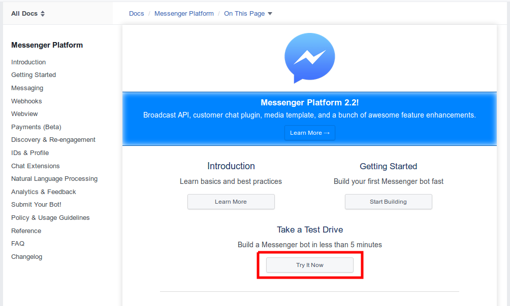
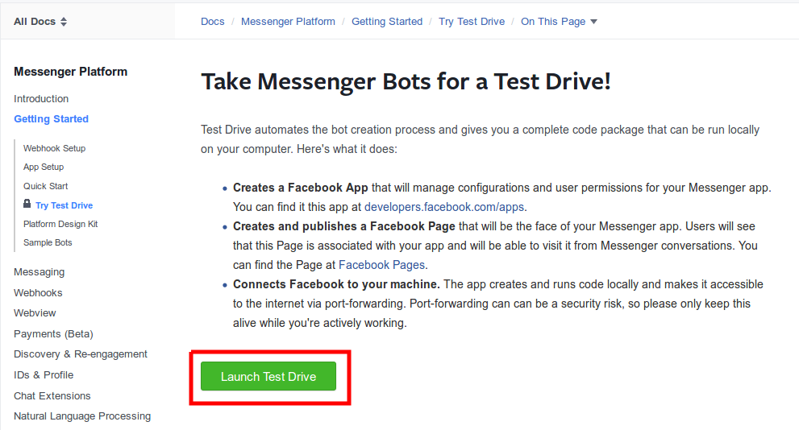
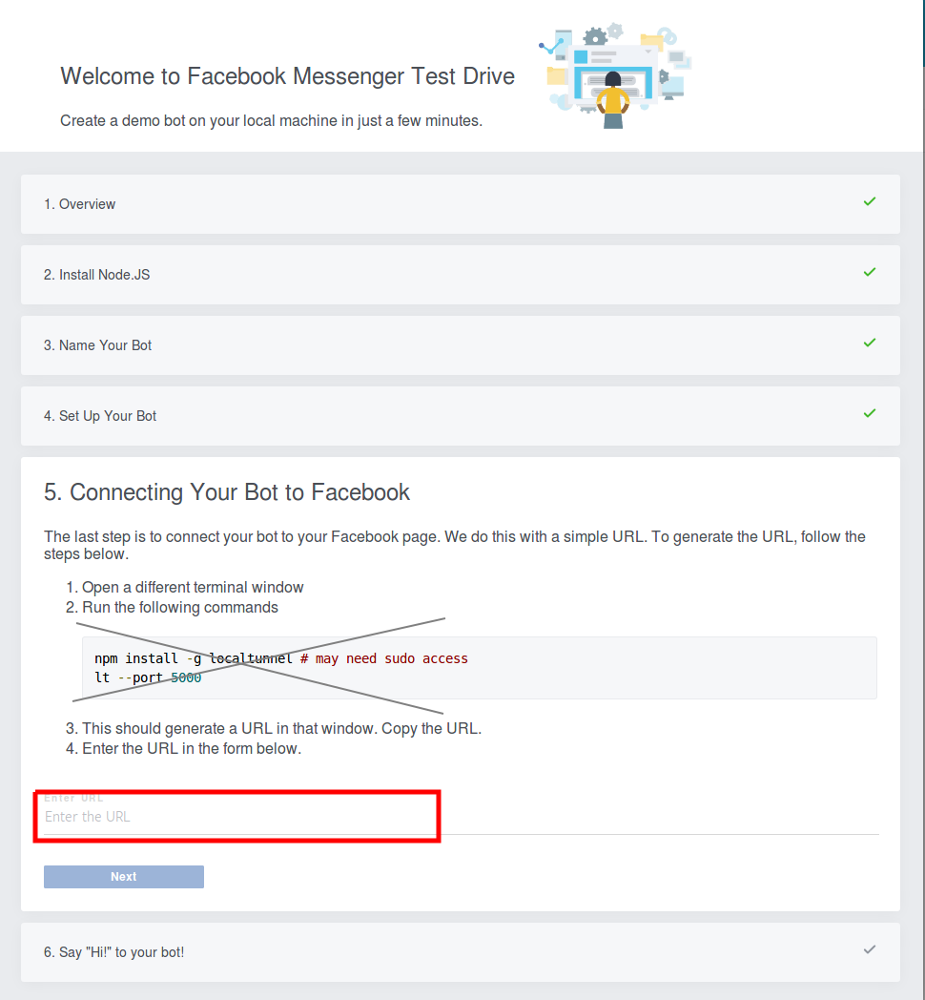
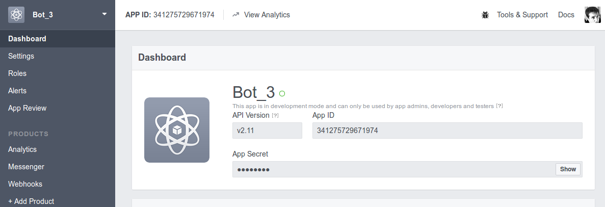
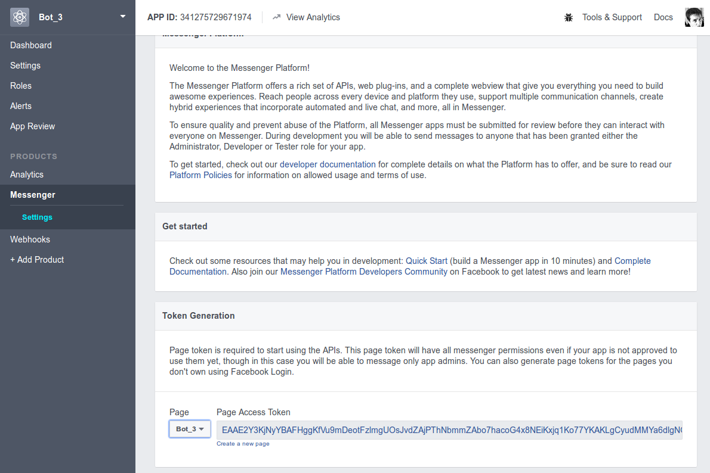
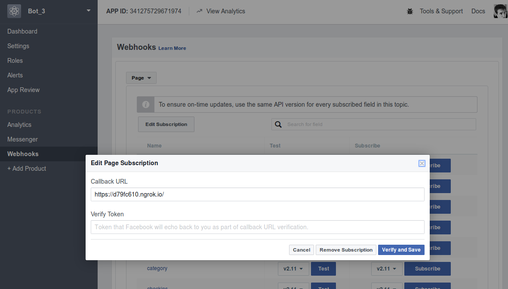

## Paysera Chat Bot Workshop

### Requirements
 * `PHP >=5.5`
 * `composer`
 * [ngrok](https://ngrok.com/download)
 * Facebook Account
 
### Setup instructions
 
 #### PHP server
 For simplicity of this task, we will use built-in PHP server.
 * install dependencies with `composer install`
 * from project's directory run in console `php -S localhost:9999`.
 * check local PHP server is running - in browser go to `http://localhost:9999/` - you should see a blank page.
 
 #### ngrok
 Ngrok is local proxy allowing your PC to be accessible from Internet.
 * download `ngrok` from https://ngrok.com/download and extract it in project directory.
 * make sure it is executable - run in console: `./ngrok`.
 * start `ngrok` to have public proxy - `./ngrok http 9999`.
 * make sure everything is OK with `ngrok` by going to [http://127.0.0.1:4040/inspect/http](http://127.0.0.1:4040/inspect/http)

 #### Facebook App Setup
 
 1. Chatbot will need a facebook page to work. Create page in facebook if you don't have one 
 1. Go to [Developer facebook.com](https://developers.facebook.com) and click `Add new App`
  
    1. Enter the name of your app (ex. Chatbot workshop)

 1. You will be redirected to you project configuration page
 1. Fill required steps: 
    1. Get your `App id` and `App secret` 
    1. Add messenger product to your application 
    1. Select page that will use this app (may require to add permissions). `Page Access Token` will be generated. Add it to your application 
    1. Click `Subscribe To Events` in `Webhooks` section
    1. Fill url you got from `ngrok` setup, other fields should be as it is in screenshot.  
    1. Select a page to subscribe your webhook to the page events 
 1. If everything was according to plan, you can open Messenger, search for chat bot and he should reply to you.

 #### Changed ngrok hostname?
 In case you restarted `ngrok`, you will receive a new public hostname, you need to change it in `App Webhooks`
